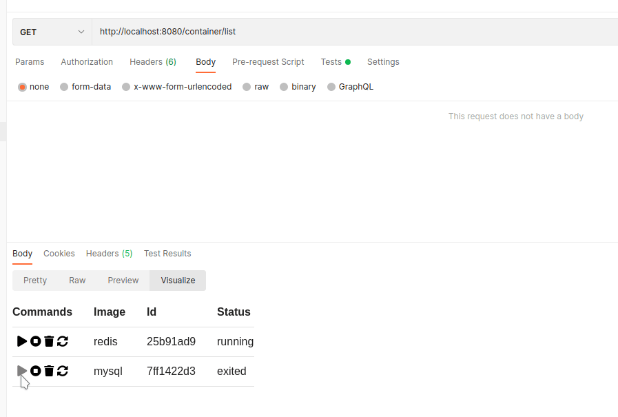
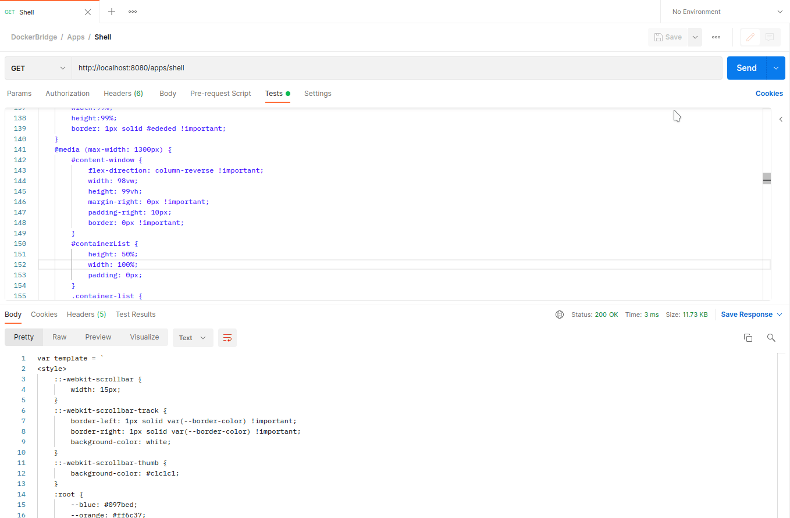

# DockerBridge

This is the ultimate answer to "what should not be done with [Postman](https://www.postman.com/)?"

The answer is simple: running custom Apps in the Postman Visualizer Tab

This bridge allows us to enter docker commands via rest. 
This itself doesnt sounds that bad good, but in combination
with Postman and its JS Sandbox, we can do some insane stuff.

This project uses [docker-java](https://github.com/docker-java/docker-java)
and hosts a restapi via [spring.io](https://spring.io/)

This repo has an [example collection](/DockerBridge.postman_collection.json) for you to import in postman

## [Portainer](https://www.portainer.io/)

Yes, since we have complete access to docker we can just run a (simple)
portainer version inside Postman:

  
Click here for the Test Script Code

    
    var template = `
    <link rel="stylesheet" href="https://pro.fontawesome.com/releases/v5.10.0/css/all.css" integrity="sha384-AYmEC3Yw5cVb3ZcuHtOA93w35dYTsvhLPVnYs9eStHfGJvOvKxVfELGroGkvsg+p" crossorigin="anonymous"/>
    
    
    <table bgcolor="#FFFFFF">
    <tr>
        <th>Commands</th>
        <th>Image</th>
        <th>Id</th>
        <th>Status</th>
    </tr>
        {{#each containers}}
        <tr>
            <td style="text-align:center">
                <a onclick="docker('{{this.Id}}', 'start')"><i class="fas fa-play"></i></a>
                <a onclick="docker('{{this.Id}}', 'stop')"><i class="fas fa-stop-circle"></i></a>
                <a onclick="docker('{{this.Id}}', 'remove')"><i class="fas fa-trash"></i></a>
                    <a onclick="docker('{{this.Id}}', 'restart')"><i class="fas fa-sync-alt"></i></a>
            </td>
            <td>{{this.Image}}</td>
            <td>
                
                    {{this.Id}}
                
            </td>    
            <td>
                {{this.State}}
            </td>
        </tr>
        {{/each}}
    </table>
    `;
    
    var header = pm.response.json()[0];
    var data = pm.response.json().slice(1);
    
    pm.visualizer.set(template, {
    containers: pm.response.json(),
    ownUrl: pm.request.url.toString()
    });

## Complete Shell

If we can exec via rest, then it shouldnt be an issue to host your own shell.
We use 3 Endpoints here: 
* 1 Endpoint to download the code (use eval(responseBody)
to load the data)
* 1 Endpoint to open the session (exec process)
* 1 Endpoint to write to the session

## Installation

1. add the [docker-java](https://github.com/docker-java/docker-java) 
dependency to your project
2. copy the [DockerBridgeController](/src/main/java/ask/me/again/dockerbridge/DockerBridgeController.java) into your project
3. (Optional) Import the example [PostmanCollection](/DockerBridge.postman_collection.json) into Postman
4. done